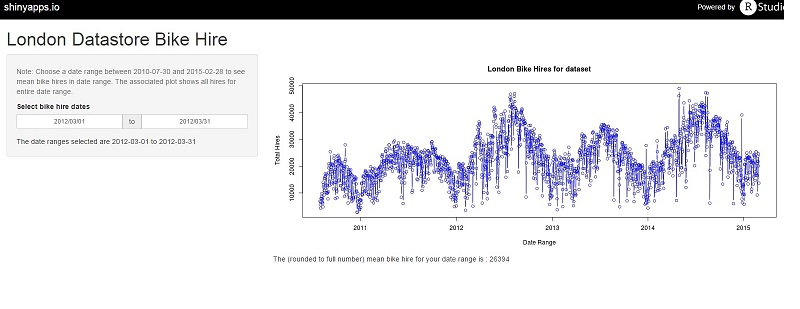

<style>
.reveal h3 {
    color: #c1d192;
    text-align: left;
    padding-bottom: 10px;
    font-family: Impact, sans-serif;
}
</style>


## Introduction

The following slides cover the following
- Data set on which application is based 
- Intent of application
- Brief description of code
- Brief Description of use

--- .class #id 

## Data set for application

- Taken from [London Data Store], data sets available under the [UK Open Government Licence] (OGL) 
- This dataset is for the [Barclays Cycle Hire Scheme] data set

[London Data Store]:http://data.london.gov.uk/
[UK Open Government Licence]:http://www.nationalarchives.gov.uk/doc/open-government-licence/version/2/
[Barclays Cycle Hire Scheme]:http://data.london.gov.uk/dataset/number-bicycle-hires/resource/e7084341-d2ce-4a13-8859-cbae32106ed1

--- .class #id 

## Intent
- Allow the mean number of bike hires to be seen based on date ranges (from launch date to Feb 2015)
- Can see overall bike hires over bike hire history in plot 
- Rough tool to give indication mean bike hires throughout date range
- Future iterations of app could predict bike availability based on date

--- .class #id 

## Code usage
- Hardcoded date example below for March 2012 for indicative usage


```r
   hiredates <- subset(cycledata, Day >= '2012/03/01')
   hiredates <- subset(hiredates, Day <= '2012/03/31')
   print("The (rounded to full number) mean bike hire for your date range is : ") 
```

```
## [1] "The (rounded to full number) mean bike hire for your date range is : "
```

```r
   round(mean(hiredates$dailybikehires),0)
```

```
## [1] 26394
```

--- .class #id 

## Application usage

- Choose start and end date. 
- Side panel updates reactively with date range chosen
- Mean bike hires (rounded) for date range shown in main panel
